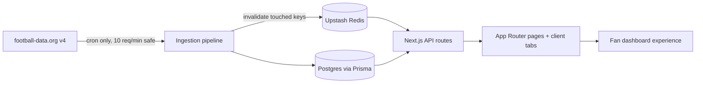

# Football Fan Dashboard

> A portfolio-grade soccer dashboard built with Next.js App Router, Prisma, PostgreSQL, Upstash Redis, Tailwind CSS, Framer Motion, and a small sport-focused component system.


## Matchday View

This app is shaped like a real football product, not a generic demo. It has a tokenized visual system, a cache-first data layer, an ingestion pipeline that respects the free `football-data.org` rate limit, and real-data browsing pages for competitions, teams, players, and matches.



## Current Progress

| Phase | Status | Commit | What landed |
| --- | --- | --- | --- |
| Phase 0 | Complete | `f8da1d0` | Next.js 15 scaffold, Prisma schema through `Standing`, design tokens, motion tokens, fonts, initial migration. |
| Phase 1 | Complete | `983d6d9` | App shell, UI primitives, football components, responsive navigation, mock-data page stubs. |
| Phase 2 | Complete | `0760c72` | Rate-limited football-data client, ingestion mappers, sync orchestrator, cache wrapper, protected cron route. |
| Phase 3a | Complete | `8c7937b` | Competitions browsing, standings, scorers, fixtures, cache-aside queries, API routes. |
| Phase 3b | Complete | `296338b` | Team detail page, squad, fixtures, form chart, team query/API pattern. |
| Phase 3c | Complete | `01f5873` | Player detail page, club and international stat split, player query/API pattern. |
| Phase 3d | Complete | `4328abb` | Match detail page, events timeline, lineups free-tier empty state, live-window cache TTL. |

The canonical continuation guide is [docs/PROJECT-HANDOFF.md](docs/PROJECT-HANDOFF.md). Read that before editing.

## Fast Start

```bash
npm install
npm run dev
```

Open [http://localhost:3000](http://localhost:3000).

For real data, create `.env` from `.env.example`, configure Neon/Postgres, Upstash Redis, a football-data.org API key, and `CRON_SECRET`, then run the ingestion route locally or through Vercel Cron.

## Useful Commands

```bash
npm run lint
npx tsc --noEmit
npm run build
npx prisma migrate dev
```

## Project Shape

| Area | Files |
| --- | --- |
| App routes | `app/**/page.tsx`, `app/api/**/route.ts` |
| Shared app shell | `components/layout/app-shell.tsx` |
| Sport-agnostic UI | `components/ui/*` |
| Football components | `components/football/*` |
| Feature clients | `components/competitions/*`, `components/teams/*`, `components/players/*`, `components/matches/*` |
| Query layer | `lib/queries/*` |
| Ingestion | `lib/football-data-client.ts`, `lib/ingestion/*` |
| Cache | `lib/cache.ts` |
| Data model | `prisma/schema.prisma` |
| Agent guide | `docs/CLAUDE.md`, `docs/PROJECT-HANDOFF.md`, `docs/qa-checklists.md` |

## Non-Negotiable Architecture Rule

Pages and client components never call `football-data.org` directly. The only external football API caller is the ingestion path. UI reads from this app's API routes, which read from Upstash Redis or Postgres.

