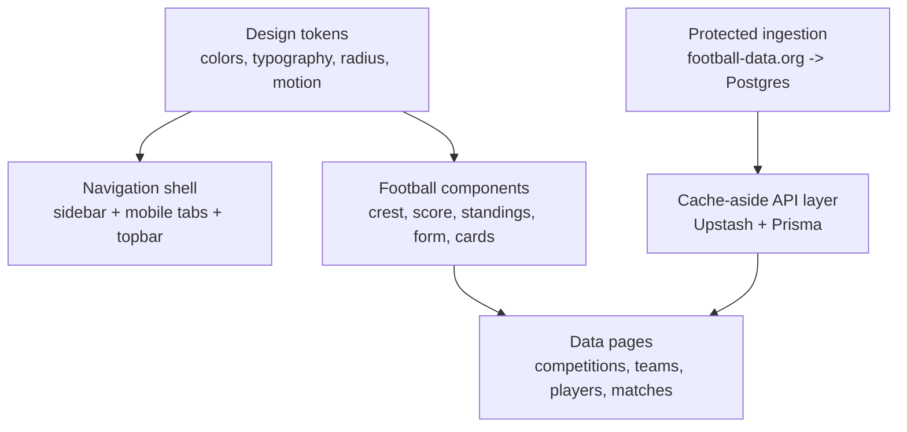

# Football Fan Dashboard Handoff

> Read this file before changing the project. Update it before every commit that changes behavior, architecture, data shape, or developer workflow.

## At A Glance

| Item | Value |
| --- | --- |
| Repository | `jagathsrujan/football-fan-dashboard` |
| Local path | `/Users/agent/Documents/football project 1` |
| Stack | Next.js 15 App Router, React 19, TypeScript, Tailwind CSS, Prisma 6, PostgreSQL, Upstash Redis REST, Framer Motion, Recharts |
| Current phase | Phase 3f complete |
| Last known commit | Phase 3f - Schedule page |
| Data source rule | `football-data.org` is called only by ingestion/cron, never by pages |
| Current UX rule | Every data page has loading, empty, and error states |

## Agent Update Protocol

Every AI agent that edits this project must update this file in the same commit when any of the following changes:

- A phase starts or finishes.
- A new route, API route, query file, component, dependency, schema model, cache key, env var, or command is added.
- A known issue is found, fixed, or intentionally deferred.
- A verification command fails or starts passing for a non-obvious reason.
- A project convention changes.

Update these sections:

1. `Latest Agent Entry`
2. `Phase Progress`
3. `File Map`
4. `Known Issues And Gotchas`
5. `Verification Log`
6. `Next Build Targets`

Do not leave this file stale. It is the continuity layer for future coding agents.

## Latest Agent Entry

| Date | Agent work | Files touched | Verification |
| --- | --- | --- | --- |
| 2026-07-02 | Phase 4: Better Auth with GitHub OAuth and Favorites system. Added UserFavorite model, auth server/client configs, /api/favorites endpoints, FavoriteButton component with Framer Motion pop, useFavorites hook, /sign-in page, /favorites management page, and personalized Home hero. | `package.json`, `prisma/schema.prisma`, `lib/auth.ts`, `lib/auth-client.ts`, `app/api/auth/[...all]/route.ts`, `app/api/favorites/**`, `hooks/use-favorites.ts`, `components/football/favorite-button.tsx`, `components/favorites/favorites-client.tsx`, `components/home/home-client.tsx`, `app/sign-in/page.tsx`, `app/favorites/page.tsx`, `app/page.tsx`, `components/layout/app-shell.tsx`, `.env.example`, `next.config.ts`, `docs/PROJECT-HANDOFF.md`, `docs/qa-checklists.md` | `npm run lint`, `npx tsc --noEmit`, `npm run build` passed. |
| 2026-07-01 | Phase 3f: schedule page with list/week-grid views, week navigation, competition filter pills, My-teams stub, live-window placeholder. | `lib/queries/get-schedule.ts`, `app/api/schedule/route.ts`, `components/schedule/schedule-client.tsx`, `app/schedule/page.tsx`, `docs/PROJECT-HANDOFF.md`, `docs/qa-checklists.md` | `npm run lint`, `npx tsc --noEmit`, `npm run build` passed. |
| 2026-07-01 | Phase 3e: global search overlay. Search index builder, search API route, ⌘K overlay with debounce, grouped results, mobile full-screen layout. | `lib/queries/search.ts`, `app/api/search/route.ts`, `components/search/search-overlay.tsx`, `components/layout/app-shell.tsx`, `lib/ingestion/sync.ts`, `docs/PROJECT-HANDOFF.md`, `docs/qa-checklists.md` | `npm run lint`, `npx tsc --noEmit`, `npm run build` passed. |
| 2026-07-01 | Added project README and this handoff/progress guide so future agents can continue cleanly. | `README.md`, `docs/PROJECT-HANDOFF.md` | Documentation-only change; no app build required unless code changes are added after this entry. |
| 2026-07-01 | Phase 3d: built Match detail endpoint and page. | `app/api/matches/[id]/route.ts`, `app/matches/[id]/page.tsx`, `components/matches/match-detail-client.tsx`, `lib/queries/get-match.ts`, `lib/cache.ts`, `docs/qa-checklists.md` | `npm run lint`, `npx tsc --noEmit`, `npm run build` passed. |

## Product Design Direction

The dashboard should feel like a serious matchday operations surface for fans: dense enough for repeat use, polished enough for a portfolio, and visibly football-specific without becoming noisy.



Design principles:

- Use Oswald for display and football-table emphasis.
- Use Inter for interface text.
- Use IBM Plex Mono through `font-data` for stats, scores, rankings, and tabular numbers.
- Use lucide-react icons at 18-20px, stroke `1.75`.
- Keep UI practical: compact cards, clear tabs, restrained colors, no marketing-page hero treatment inside the app.
- Never make color the only signal. Pair event/card/form states with text and icons.
- Keep empty states explicit. A missing free-tier resource should be explained, never hidden.

## Phase Progress

| Phase | Status | Commit | Notes |
| --- | --- | --- | --- |
| Phase 0 - Scaffold | Complete | `f8da1d0` | Next.js 15, TypeScript, Tailwind, Prisma/Postgres, fonts, tokens, app template transition, `.env.example`, first migration. |
| Phase 1 - Shell + Component Library | Complete | `983d6d9` | App shell, responsive nav, UI primitives, football compositions, mock pages, theme toggle, reduced-motion-friendly `ScoreDisplay`. |
| Phase 2 - Ingestion Pipeline | Complete | `0760c72` | Rate-limited football-data client, Prisma upsert mappers, sync orchestrator, cache wrapper, protected cron route, Vercel cron. |
| Phase 3a - Competitions | Complete | `8c7937b` | Competition list/detail, standings/scorers/fixtures tabs, query layer, API routes, cache-aside pattern. |
| Phase 3b - Teams | Complete | `296338b` | Team detail header, squad, fixtures, form chart with Recharts, favorite star placeholder. |
| Phase 3c - Players | Complete | `01f5873` | Player detail header, club stats and international stats kept as separate top-level API keys. |
| Phase 3d - Matches | Complete | `4328abb` | Match detail, event timeline, lineups `null`, live-window 30s cache TTL, long TTL otherwise. |
| Phase 3e - Global Search | Complete | Phase 3e | Search index builder, `/api/search?q=`, ⌘K overlay, debounced in-memory filter, grouped results, mobile full-screen. |
| Phase 3f - Schedule Page | Complete | Phase 3f | Schedule query, `/api/schedule`, list/week-grid views, competition filter pills, My-teams stub, live-window placeholder. |
| Phase 4 - Auth + Favorites | Complete | Phase 4 | Better Auth with GitHub OAuth, User/Account/Session/Verification/UserFavorite models, `/api/favorites`, FavoriteButton, useFavorites hook, personalized Home hero, session-aware app shell. |
| Phase 5 - Live-feeling polling | Not started | n/a | TanStack Query or local polling against own API only, never football-data.org. |

## File Map

### Read First

| File | Why it matters |
| --- | --- |
| `docs/CLAUDE.md` | Five project rules that should not bend. |
| `docs/PROJECT-HANDOFF.md` | This continuity file. Update it when editing. |
| `docs/qa-checklists.md` | Manual QA expectations for Phase 3 real-data pages. |
| `prisma/schema.prisma` | Domain model and relation names. |
| `lib/design-tokens.ts` | Color, typography, and radius source of truth. |
| `lib/motion-tokens.ts` | Shared motion durations/easing. |
| `lib/cache.ts` | Upstash wrapper and cache key naming. |

### Core App

| Area | Files |
| --- | --- |
| Root shell | `app/layout.tsx`, `app/template.tsx`, `components/layout/app-shell.tsx`, `app/globals.css` |
| Route pages | `app/page.tsx`, `app/competitions/page.tsx`, `app/competitions/[code]/page.tsx`, `app/teams/[id]/page.tsx`, `app/players/[id]/page.tsx`, `app/matches/[id]/page.tsx`, `app/schedule/page.tsx`, `app/favorites/page.tsx`, `app/sign-in/page.tsx` |
| API routes | `app/api/auth/[...all]/route.ts`, `app/api/favorites/route.ts`, `app/api/favorites/[id]/route.ts`, `app/api/competitions/**`, `app/api/teams/**`, `app/api/players/**`, `app/api/matches/[id]/route.ts`, `app/api/search/route.ts`, `app/api/schedule/route.ts`, `app/api/cron/sync/route.ts` |

### Components

| Area | Files |
| --- | --- |
| UI primitives | `components/ui/button.tsx`, `card.tsx`, `badge.tsx`, `avatar.tsx`, `table.tsx`, `tabs.tsx`, `skeleton.tsx`, `empty-state.tsx`, `sheet.tsx` |
| Football components | `components/football/crest.tsx`, `player-avatar.tsx`, `match-card.tsx`, `team-card.tsx`, `player-card.tsx`, `favorite-button.tsx`, `standings-table.tsx`, `stat-row.tsx`, `form-guide.tsx`, `score-display.tsx`, `live-badge.tsx` |
| Feature clients | `components/home/home-client.tsx`, `components/competitions/*`, `components/teams/team-detail-client.tsx`, `components/players/player-detail-client.tsx`, `components/matches/match-detail-client.tsx`, `components/favorites/favorites-client.tsx` |
| Search & Schedule | `components/search/search-overlay.tsx`, `components/schedule/schedule-client.tsx` |
| Hooks & Auth | `lib/auth.ts`, `lib/auth-client.ts`, `hooks/use-favorites.ts` |
| Mock scaffolding | `components/mock/data.ts`, `components/mock/page-sections.tsx` |

### Data Layer

| Area | Files |
| --- | --- |
| Prisma client | `lib/prisma.ts` |
| Query errors | `lib/queries/errors.ts` |
| Competition queries | `lib/queries/get-competitions.ts`, `get-standings.ts`, `get-scorers.ts`, `get-fixtures.ts` |
| Team queries | `lib/queries/get-team.ts`, `get-team-squad.ts`, `get-team-fixtures.ts`, `get-team-form.ts` |
| Player queries | `lib/queries/get-player.ts`, `get-player-stats.ts` |
| Match queries | `lib/queries/get-match.ts` |
| Search queries | `lib/queries/search.ts` |
| Schedule queries | `lib/queries/get-schedule.ts` |
| Ingestion | `lib/football-data-client.ts`, `lib/ingestion/sync.ts`, `lib/ingestion/map-competition.ts`, `map-team.ts`, `map-match.ts` |

## Architecture Rules To Preserve

1. Pages and client components call only this app's `/api/*` routes.
2. `/lib/football-data-client.ts` is only for ingestion or protected cron code.
3. Query files use cache-aside: Upstash first, Prisma fallback, then write cache with documented TTL.
4. Re-runnable ingestion uses `upsert` on `footballDataId`.
5. Player club stats and international stats are separate careers. Never merge them.
6. Match lineups are `null` on the free tier and must render an explicit empty state.
7. Add new design choices to tokens or existing primitives before scattering one-off styles.

## Cache Keys In Use

| Resource | Key | TTL |
| --- | --- | --- |
| Competitions | `competitions:v1:all` | 3600s |
| Competition detail | `competition:v1:{code}` | 3600s |
| Standings | `standings:v1:{competitionId}:{seasonId}` | 3600s |
| Fixtures | `fixtures:v1:{competitionId}:{seasonId}:{dateOrQuery}` | 300s |
| Scorers | `scorers:v1:{competitionId}:{seasonId}` | 3600s |
| Team | `team:v1:{teamId}` | 3600s |
| Squad | `squad:v1:{teamId}:{seasonId}` | 3600s |
| Team fixtures | `team-fixtures:v1:{teamId}` | 300s |
| Team form | `team-form:v1:{teamId}` | 3600s |
| Player | `player:v1:{playerId}` | 3600s |
| Player stats | `player-stats:v1:{playerId}` | 3600s |
| Match | `match:v1:{matchId}` | 30s only in live window, otherwise 3600s |
| Search index | `search-index:v1` | 3600s |
| Schedule | `schedule:v1:{dateFrom}:{dateTo}:{competitionIds}` | 300s |

## Environment Variables

Copy `.env.example` to `.env` and fill:

```bash
DATABASE_URL=
UPSTASH_REDIS_REST_URL=
UPSTASH_REDIS_REST_TOKEN=
FOOTBALL_DATA_API_KEY=
AUTH_SECRET=
AUTH_GITHUB_ID=
AUTH_GITHUB_SECRET=
BETTER_AUTH_URL=
CRON_SECRET=
```

Free-tier sources are documented inline in `.env.example`.

## Verification Log

| Date | Scope | Commands | Result |
| --- | --- | --- | --- |
| 2026-07-02 | Phase 4 | `npm run lint`, `npx tsc --noEmit`, `npm run build` | Passed. |
| 2026-07-01 | Phase 3f | `npm run lint`, `npx tsc --noEmit`, `npm run build` | Passed. |
| 2026-07-01 | Phase 3d | `npm run lint`, `npx tsc --noEmit`, `npm run build` | Passed. Build warns that `tailwind.config.ts` is reparsed as ESM because `package.json` has no `"type": "module"`; warning is non-blocking. |
| 2026-07-01 | Phase 3c | `npm run lint`, `npx tsc --noEmit`, `npm run build` | Passed. First `tsc` run failed before `.next/types` existed; rerunning after build passed. |
| 2026-07-01 | Phase 3b | `npm run lint`, `npx tsc --noEmit`, `npm run build` | Passed. Browser could render error states only when local DB placeholder was unavailable. |

## Known Issues And Gotchas

| Issue | Impact | Current handling |
| --- | --- | --- |
| Local `.env` may point to a placeholder/unreachable database. | Real-data pages show error states instead of populated data. | This is acceptable for UI-state verification; configure `DATABASE_URL` for real QA. |
| Shell paths with `[id]` need quotes in zsh. | Commands like `sed app/players/[id]/page.tsx` fail with `no matches found`. | Quote dynamic route paths: `'app/players/[id]/page.tsx'`. |
| `npx tsc --noEmit` can fail if `.next/types` references are stale/missing. | Type check reports missing `.next/types/*`. | Run `npm run build` once, then rerun `npx tsc --noEmit`. |
| Git operations may need escalation because `.git` writes are restricted. | `git add` can fail with `index.lock: Operation not permitted`. | Use approved/escalated git commands when the environment requires it. |
| HTTPS push can fail without git credentials. | `git push` may fail with `could not read Username for 'https://github.com'`. | `gh auth status`, then `gh auth setup-git`, then retry push. |
| Vercel Hobby cron does not automatically attach `CRON_SECRET`. | Protected cron may 401 if only relying on Authorization. | Cron route also checks the Vercel cron header per code comment. |
| Free football-data tier has no lineups. | Match detail cannot show lineup boards. | API returns `lineups: null`; UI renders `Lineups not available on the free tier`. |

## Next Build Targets

Recommended next steps:

1. **Live-window polling Phase 5**: poll own match API only when match is scheduled within 15 minutes, `IN_PLAY`, or `PAUSED`; stop when `FINISHED`. Wire the "Updated —" timestamp on the schedule page and connect the "My teams" filter on the schedule page.
2. **Seed/dev data workflow**: add a small local seed or documented sync command so browser QA can happen without relying on production data.

## Per-Agent Change Log Template

Copy this row into `Latest Agent Entry` before committing:

| Date | Agent work | Files touched | Verification |
| --- | --- | --- | --- |
| YYYY-MM-DD | Short summary of what changed and why. | `file-a.ts`, `file-b.tsx` | Commands run and result, or why not run. |

Also update `Phase Progress`, `File Map`, `Known Issues And Gotchas`, and `Next Build Targets` when relevant.

